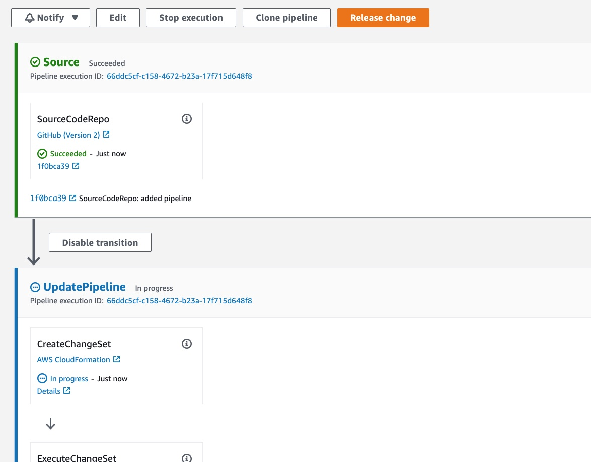
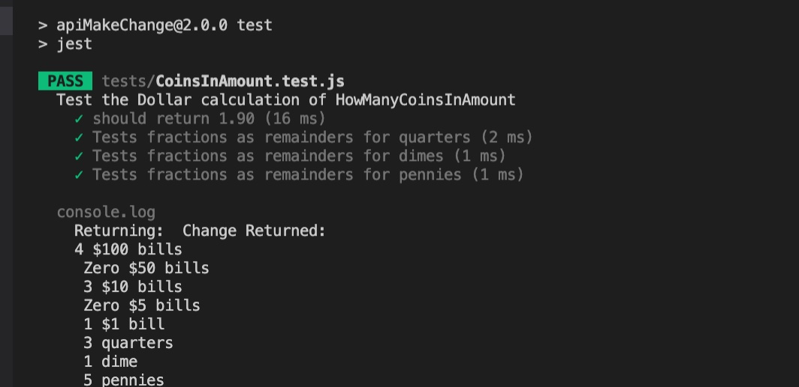
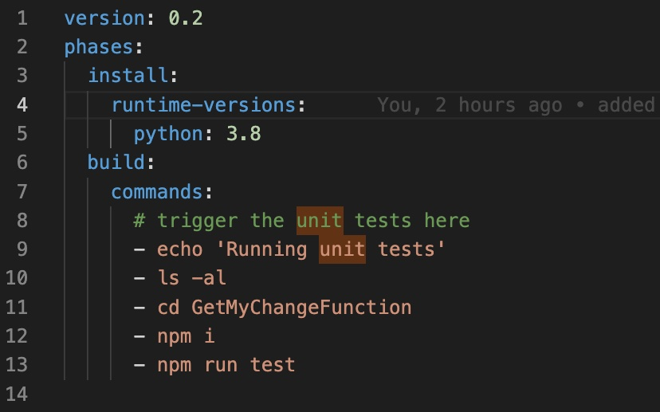

# GetMeMyChange

This solution Deploys a NodeJS Lambda function behind an API Gateway REST API. It uses AWS Serverless Application Model (SAM) to create the resources. 

In addition, a CI/CD pipeline is used to build, test, and deploy the REST API using SAM Pipelines (pipeline creation is not part of this repo). 

# The Pipeline

On each commit to this repo, the application (in this case a lambda function that calculates change in dollars) will go through a complete CI/CD pipeline, including unit and integration tests before getting deployed into a production environment.

The pipelines are created using SAM pipelines, a new feature of the SAM cli. The pipelines create all necessary resources on the specified AWS account. 

The pipeline incorporates the Git Flow model, where each new feature branch becomes it's own pipeline and creates and manages it's own resources. Feature branches merged into main branch will go through this scenario:

  1. Build: Lambda function is built and any syntax errors will stop deployments.
  2. Unit Test phase: run basic functional testing.
  3. Deployment to test environment: Deploys resources. A manual stage can be added here if desired.
  4. Integration test phase: More testing.
  5. Deployed to Production if all previous phases complete successfully.

<br/>
The initial pipeline stages. CodePipeline has a nice visual interface:
<br/>


<br/>

  The prod endpoint is https://9qpx4gggp0.execute-api.us-west-2.amazonaws.com/Prod .

## Creating feature branches

Creating feature branches requires some manual effort. This is a good thing because this operation will create resources on your AWS account. If you have the right credentials:

```
  - git branch -b feature-number1
  - git push origin feature-number1
  - sam deploy -t codepipeline.yaml --stack-name feature-number1-pipeline --capabilities=CAPABILITY_IAM \    --parameter-overrides="FeatureGitBranch=feature-number1"

  <YOUR-FEATURE-NAME> should begin with the word "feature-" i.e. feature-number1.
```


Once the pipeline runs for the first time you can retrieve your dev and prod URLS from the console.
# The lambda function

The Application is a simple lambda function that calculates change based on inputs. The function is located in the GetMyChangeFunction folder. When executed it should accept two arguments:

  1) “Total cost” (In USD)
  2) “Amount provided” (also in USD).  

Return as output the change that should be provided, not in USD, but instead by returning the count of each denomination of bills and/or coins that should be returned as change. 

  Example:
  (INPUT)
  Total cost: $1.29
  Amount Provided: $5.00

  (OUTPUT)
  Change Returned: 
  3 $1 bills
  2 quarters
  2 dimes
  1 penny

# Unit Tests

The lambda function contains a few basic Jest unit tests in GetMyChangeFunction/tests/CoinsInAmount.test.js:




<br/><br/>

The build templates are completely customizable. Here is the unit testing build phase config:



# Pre-reqs:

  - An AWS Account
  - AWS SAM installed locally

# To Run:

There is a front end "UI" in this repo that uses axios to call the REST API: ./FrontEnd. To run the demo application:

  - cd FrontEnd
  - npm i
  - node MakeChange TotalCost=1.29 AmountProvided=5.00

# Conclusion

If you want more details about how you can create your these pipelines in your own environment let me know. Or happy to answer any questions.


